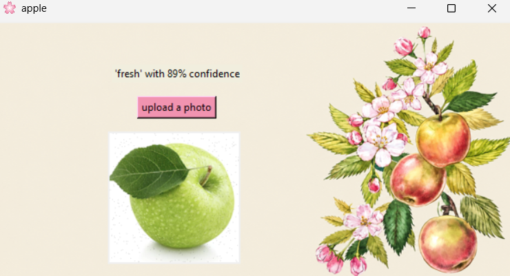

# Healthy Apple Image Classification 🍎

## Project Overview

This project is a Python desktop application that uses a machine learning model to classify apple images.

The application allows the user to upload an apple photo from their computer. The machine learning model analyzes the image and predicts its class along with a confidence percentage.

The graphical user interface (GUI) is created using **Tkinter**, while image processing and display are handled using **Pillow**.

## Project Workflow

The project works as follows:

1. Connect to the ML for Kids image classification project.
2. Train the machine learning model.
3. Create a graphical user interface using Tkinter.
4. Display a background image in the application.
5. Allow the user to upload an apple image.
6. Display the uploaded image in the application.
7. Send the uploaded image to the machine learning model.
8. Receive the predicted class and confidence score.
9. Display the prediction and confidence percentage to the user.

## Technologies Used

* Python
* Tkinter
* Pillow (PIL)
* ML for Kids
* Machine Learning
* Image Classification

## Main Features

* Simple graphical user interface
* Upload an image from the computer
* Display the selected image
* Machine learning image classification
* Display prediction confidence
* Custom application icon
* Custom background image

## Project Files

| File      | Description                         |
| --------- | ----------------------------------- |
| `main.py` | Main Python program                 |
| `bg.png`  | Background image of the application |
| `c.ico`   | Application icon                    |

## Machine Learning Model

The project uses the `MLforKidsImageProject` class from the `mlforkidsimages` library.

The model is trained using:

```python
myproject.train_model()
```

After uploading an image, the model predicts its class using:

```python
demo = myproject.prediction(image_upload)
```

The prediction result contains the class name and confidence percentage.

## Prediction

The application displays the result in the following format:

```text
'healthy apple' with 95% confidence
```

The exact result depends on the image and the classes used to train the machine learning model.

## How to Run

### 1. Install Python

Make sure Python is installed on your computer.

### 2. Install Pillow

Run:

```bash
pip install pillow
```

### 3. Install ML for Kids Images

Make sure the `mlforkidsimages` package is available in your Python environment.

### 4. Prepare the Project Folder

Place the following files in the same folder:

```text
Healthy-Apple-Classification/
│
├── main.py
├── bg.png
└── c.ico
```

### 5. Run the Program

Run:

```bash
python main.py
```

### 6. Upload an Image

Click the **Upload a photo** button and select an apple image.

The application will display the uploaded image and show the model's prediction and confidence.

## Application Output



```


## Important Note

The accuracy of the classification depends on the images and classes used to train the machine learning model.

For reliable classification, the model should be trained with a sufficient number of clear and diverse images of healthy apples and other classes.

## Conclusion

This project demonstrates how machine learning can be combined with a graphical user interface to create a simple image classification application.

The user can upload an apple photo, and the trained model predicts its class and displays the confidence percentage.
